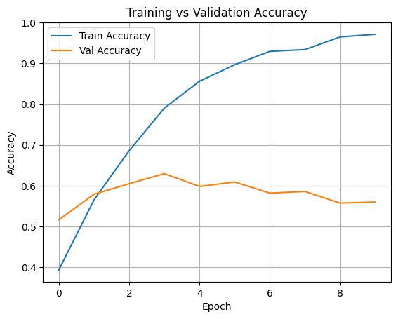
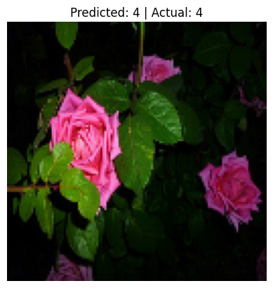

**# 🌸 Deep Learning Image Classifier using TensorFlow (TF Flowers)

## 📌 Project Overview
This project is part of my internship at **CodTech IT Solutions**. It involves developing a **deep learning model** using **TensorFlow** to classify images of flowers into 5 categories using the `tf_flowers` dataset.

## 🧠 Model Details
- Framework: TensorFlow (Keras API)
- Dataset: TF Flowers (5 flower categories)
- Image Size: 128x128
- Layers: 2 Conv2D + MaxPooling, Flatten, Dense
- Optimizer: Adam
- Loss: Sparse Categorical Crossentropy
- Accuracy Achieved: *(Insert your best accuracy here, e.g., 85%)*
- ## 📊 Visualizations

### Model Accuracy


### Sample Prediction



## 🖼️ Sample Outputs
- Sample classified images
- Accuracy vs Validation Accuracy plot
- Prediction with actual vs predicted class

## ✅ Libraries Used
- TensorFlow
- TensorFlow Datasets
- Matplotlib

## 🚀 How to Run
```bash
pip install tensorflow tensorflow-datasets matplotlib
**
